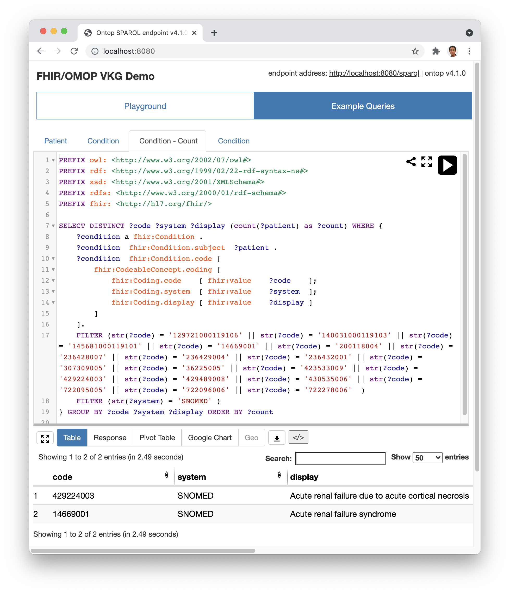

# FHIROntopOMOP

This project exposes
the [Observational Medical Outcomes Partnership (OMOP)](https://www.ohdsi.org/data-standardization/the-common-data-model/)
data as a (Virtual) Knowledge Graph compliant with the [HL7 FHIR standard](https://www.hl7.org/fhir/) using
the [Ontop](https://ontop-vkg.org/)
Virtual Knowledge Graph engine.

- Perquisite: a working connection to the OMOP database. 

## Docker-based Installation Instruction

* install Docker (<https://www.docker.com/>)
* modify [fhir.docker.properties](input/fhir.docker.properties) as needed. If the database and the docker are running on the same machine, a special attention needs to be taken on the address. See [issue#2](https://github.com/fhircat/FHIROntopOMOP/issues/2#issuecomment-895576424).
* run `docker-compose up`
* open a browser at <http://localhost:8080/> to see the Ontop SPARQL endpoint as below:

## Manual Installation Instruction

* download the Ontop Command Line Interface
  at https://github.com/ontop/ontop/releases/download/ontop-4.1.0/ontop-cli-4.1.0.zip
* unzip (into the folder of ontop-cli-4.1.0)
* modify [fhir.properties](input/fhir.properties) as needed
* copy the folders of `input` and `jdbc` into the folder of ontop-cli-4.1.0
* run `./ontop endpoint --ontology=input/fhir.ttl --mapping=input/fhir.obda --properties=input/fhir.properties`
* open a browser at <http://localhost:8080/> to see the Ontop SPARQL Endpoint
